# Agent Hub Architecture - Coordination System

## 🎯 Agent Hub Overview

The Agent Hub is the central coordination point for multi-agent systems, managing agent registration, task distribution, memory sharing, and inter-agent communication.

```mermaid
graph TB
    subgraph "Agent Hub - Central Coordinator"
        HUB[🎛️ Agent Hub Core]
        REGISTRY[📋 Agent Registry]
        QUEUE[📬 Task Queue]
        MEMORY[🧠 Shared Memory Store]
        ROUTER[🔀 Message Router]
        MONITOR[📊 Health Monitor]
    end

    subgraph "Agent Pool"
        A1[🤖 Researcher Agent]
        A2[💻 Coder Agent]
        A3[🧪 Tester Agent]
        A4[👁️ Reviewer Agent]
        A5[🏗️ Architect Agent]
        A6[📊 Analyzer Agent]
    end

    subgraph "External Systems"
        MCP[MCP Coordination Layer]
        HOOKS[Claude Flow Hooks]
        GIT[Git Repository]
        FILES[File System]
    end

    USER[👤 User Request] --> HUB

    HUB <--> REGISTRY
    HUB <--> QUEUE
    HUB <--> MEMORY
    HUB <--> ROUTER
    HUB <--> MONITOR

    REGISTRY -.registers.-> A1
    REGISTRY -.registers.-> A2
    REGISTRY -.registers.-> A3
    REGISTRY -.registers.-> A4
    REGISTRY -.registers.-> A5
    REGISTRY -.registers.-> A6

    QUEUE -.distributes.-> A1
    QUEUE -.distributes.-> A2
    QUEUE -.distributes.-> A3
    QUEUE -.distributes.-> A4
    QUEUE -.distributes.-> A5
    QUEUE -.distributes.-> A6

    A1 <-.shares context.-> MEMORY
    A2 <-.shares context.-> MEMORY
    A3 <-.shares context.-> MEMORY
    A4 <-.shares context.-> MEMORY
    A5 <-.shares context.-> MEMORY
    A6 <-.shares context.-> MEMORY

    A1 <-.communicates.-> ROUTER
    A2 <-.communicates.-> ROUTER
    A3 <-.communicates.-> ROUTER
    A4 <-.communicates.-> ROUTER
    A5 <-.communicates.-> ROUTER
    A6 <-.communicates.-> ROUTER

    MONITOR -.health checks.-> A1
    MONITOR -.health checks.-> A2
    MONITOR -.health checks.-> A3
    MONITOR -.health checks.-> A4
    MONITOR -.health checks.-> A5
    MONITOR -.health checks.-> A6

    HUB <--> MCP
    A1 --> HOOKS
    A2 --> HOOKS
    A3 --> HOOKS
    HOOKS --> GIT
    HOOKS --> FILES
```



## 🔄 Agent Hub Lifecycle: From Request to Completion


## 🏛️ Hub-and-Spoke Topology


## 🧩 Hub Components Deep Dive


## 📡 Agent Communication Patterns Through Hub


## 🎛️ Hub State Machine


## 🔄 Task Flow Through Hub


## 🧠 Memory Sharing Architecture


## 📊 Hub Monitoring Dashboard

```mermaid
graph TB
    subgraph "Hub Health Monitoring"
        DASH[📊 Dashboard]

        subgraph "Agent Metrics"
            AM1[Active Agents: 6]
            AM2[Idle Agents: 2]
            AM3[Failed Agents: 0]
            AM4[Avg Response Time: 1.2s]
        end

        subgraph "Task Metrics"
            TM1[Queued Tasks: 3]
            TM2[In Progress: 6]
            TM3[Completed: 47]
            TM4[Success Rate: 98.2%]
        end

        subgraph "Resource Metrics"
            RM1[Memory Usage: 45%]
            RM2[CPU Usage: 62%]
            RM3[Network I/O: 12 MB/s]
            RM4[Cache Hit Rate: 87%]
        end

        subgraph "Performance Metrics"
            PM1[Avg Task Time: 3.4s]
            PM2[Throughput: 18 tasks/min]
            PM3[Token Usage: 125K]
            PM4[Parallel Efficiency: 3.2x]
        end
    end

    DASH --> AM1 & AM2 & AM3 & AM4
    DASH --> TM1 & TM2 & TM3 & TM4
    DASH --> RM1 & RM2 & RM3 & RM4
    DASH --> PM1 & PM2 & PM3 & PM4

    style DASH fill:#4dabf7,color:#fff
    style AM3 fill:#51cf66
    style TM4 fill:#51cf66
    style PM4 fill:#51cf66
```



## 🔐 Hub Security & Isolation


## 🎯 Example: Full-Stack Development Through Hub


## ⚙️ Hub Configuration

```yaml
# Hub Configuration Example
agent_hub:
  # Topology
  topology: "hub-and-spoke"
  max_agents: 20

  # Task Management
  task_queue:
    max_concurrent: 10
    priority_levels: 3
    timeout: 300000  # 5 minutes

  # Memory Configuration
  memory:
    cache_size: "500MB"
    ttl: 3600  # 1 hour
    persistence: true
    sync_interval: 1000  # 1 second

  # Monitoring
  monitoring:
    health_check_interval: 5000  # 5 seconds
    metrics_collection: true
    performance_tracking: true

  # Communication
  message_router:
    max_message_size: "10MB"
    broadcast_enabled: true
    message_logging: true

  # Recovery
  fault_tolerance:
    auto_recovery: true
    max_retries: 3
    retry_delay: 2000  # 2 seconds
```

---

## Key Takeaways

1. **Centralized Coordination** - Hub manages all agent interactions
2. **Distributed Execution** - Agents work in parallel via hub orchestration
3. **Shared Memory** - Context sharing through hub's memory store
4. **Message Routing** - Inter-agent communication via hub's router
5. **Health Monitoring** - Continuous tracking and auto-recovery
6. **Task Distribution** - Intelligent assignment based on capabilities
7. **Fault Tolerance** - Automatic recovery and task reassignment
8. **Scalability** - Hub-and-spoke pattern supports growth

**The Hub is the brain, agents are the hands!** 🧠
