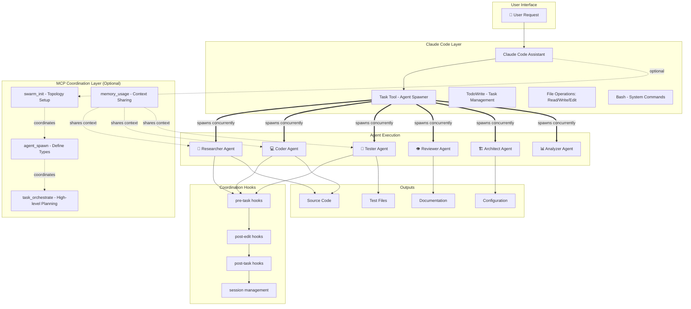
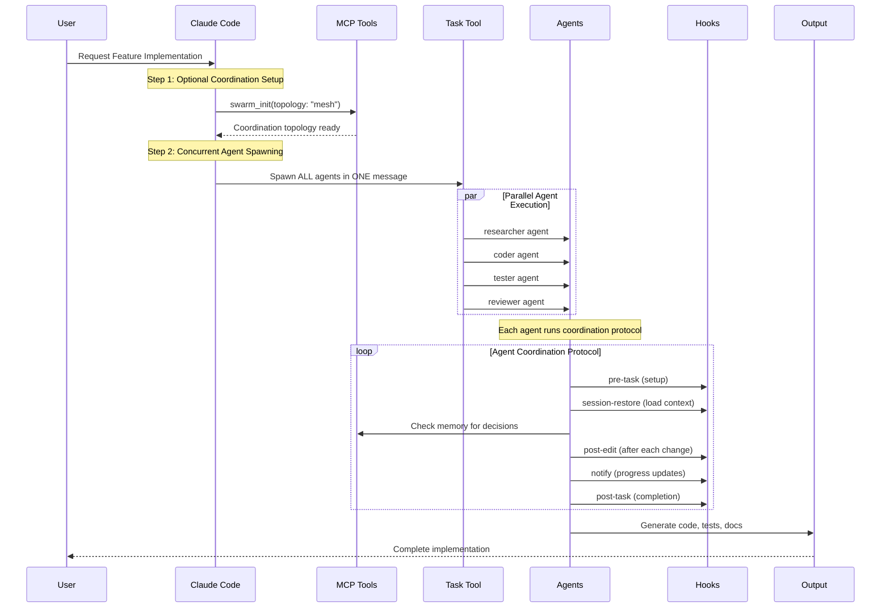
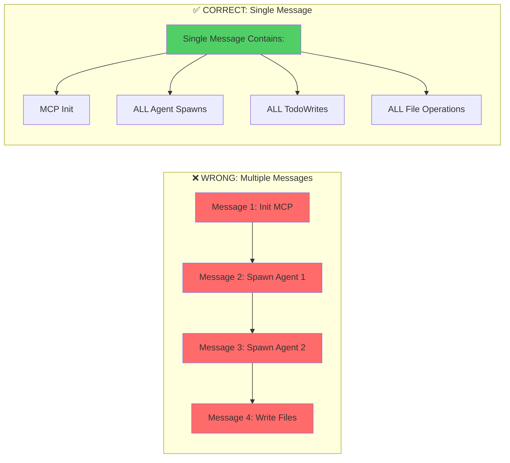
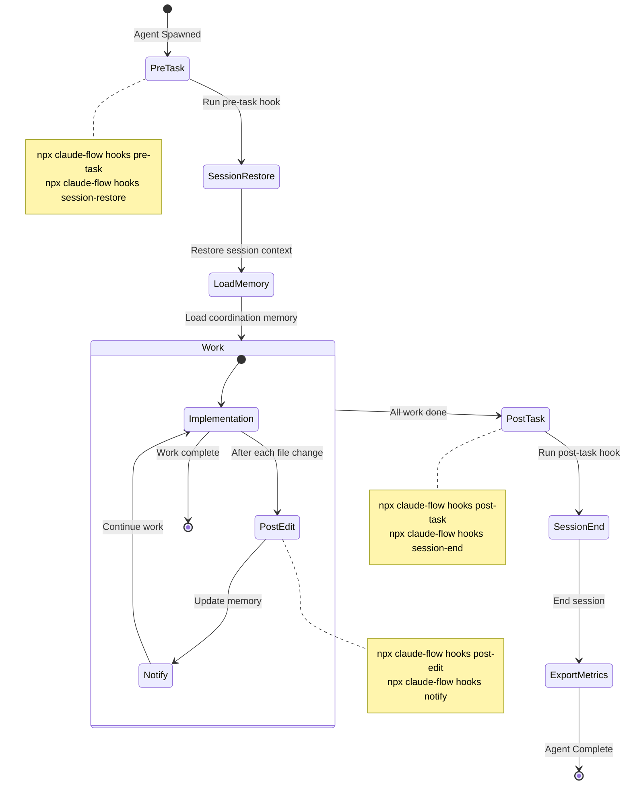
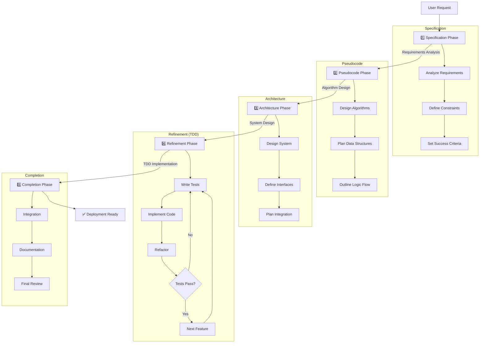
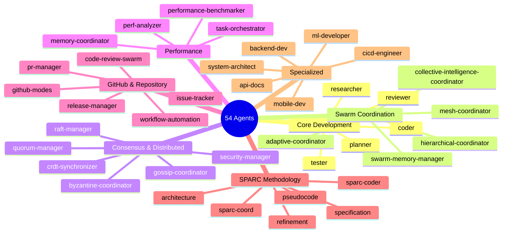
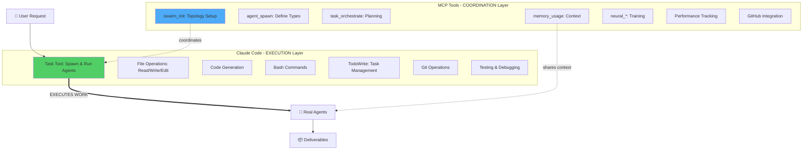
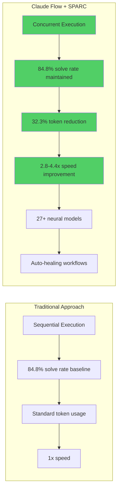
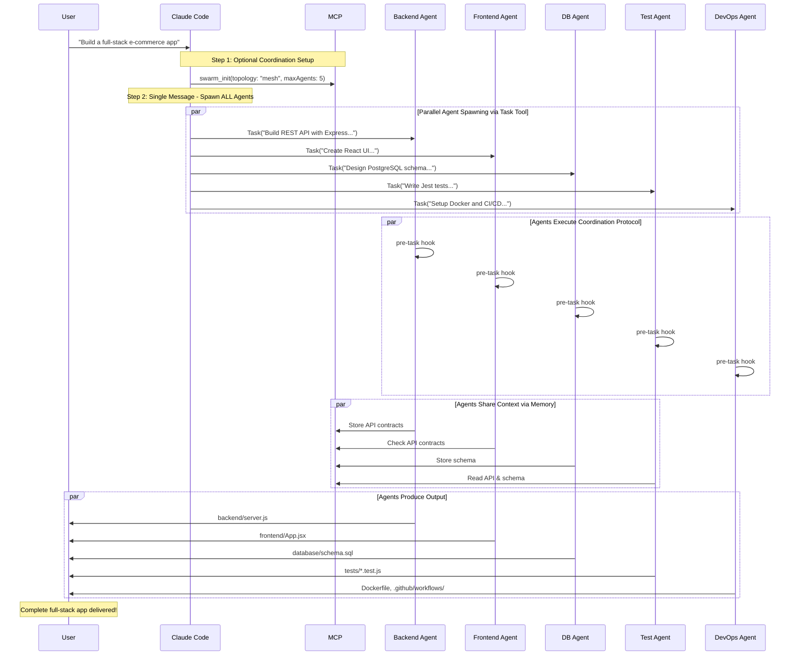

# Claude Flow + SPARC System Architecture

## 🎯 High-Level System Overview



## 🔄 Complete Workflow: MCP Coordinates, Claude Code Executes



## 🎯 The Golden Rule: "1 Message = All Operations"



## 📋 Agent Coordination Protocol (Every Agent Must Follow)



## 🏗️ SPARC Methodology Flow



## 🚀 54 Available Agents by Category



## 📁 File Organization Structure

```mermaid
graph TD
    ROOT[Project Root] --> SRC[/src - Source Code]
    ROOT --> TESTS[/tests - Test Files]
    ROOT --> DOCS[/docs - Documentation]
    ROOT --> CONFIG[/config - Configuration]
    ROOT --> SCRIPTS[/scripts - Utility Scripts]
    ROOT --> EXAMPLES[/examples - Example Code]

    ROOT -.❌ NEVER save to root.-> WRONG[❌ Working files/tests]

    SRC --> S1[server.js]
    SRC --> S2[api/]
    SRC --> S3[models/]

    TESTS --> T1[unit/]
    TESTS --> T2[integration/]
    TESTS --> T3[e2e/]

    DOCS --> D1[API.md]
    DOCS --> D2[ARCHITECTURE.md]
    DOCS --> D3[diagrams/]

    style WRONG fill:#ff6b6b
    style ROOT fill:#51cf66
```

## 🎯 Claude Code vs MCP Tools Division



## 📊 Performance Benefits



## 🔗 Complete Example: Full-Stack Development



---

## Key Takeaways

1. **MCP Coordinates Strategy** - Sets up topology, defines agent types, manages memory
2. **Claude Code Executes Work** - Task tool spawns real agents that write code
3. **1 Message = All Operations** - Batch everything for maximum concurrency
4. **Hooks Enable Coordination** - Every agent uses pre/during/post hooks
5. **SPARC Provides Structure** - Systematic methodology for TDD
6. **54 Specialized Agents** - Each with specific expertise
7. **Never Save to Root** - Organize files in proper subdirectories
8. **Performance Gains** - 2.8-4.4x speed, 32.3% fewer tokens

**Remember: Claude Flow coordinates, Claude Code creates!** 🚀
